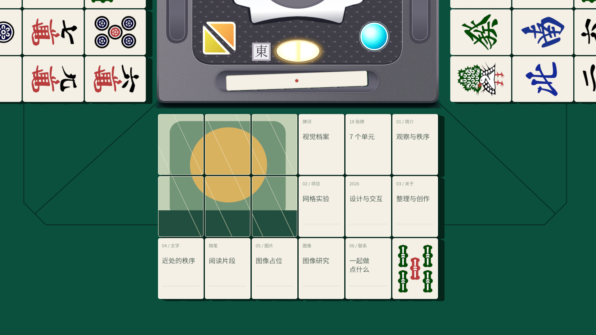
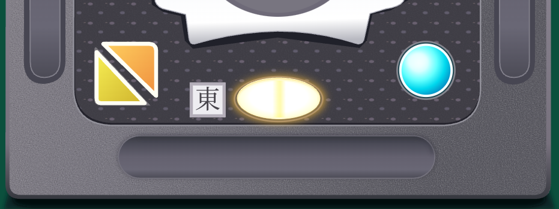
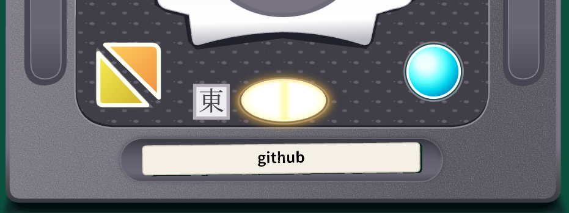
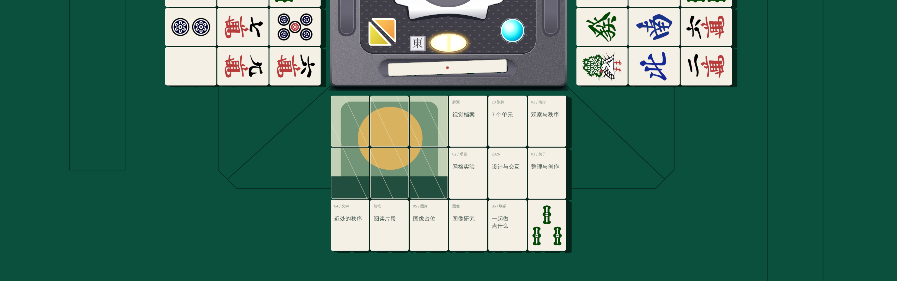

# ShinRyu · 牌河视觉档案 v2

`v2` 从 `main` 创建，保留现有交互，将麻将改为 **Three.js 三维实体 + 三渲二材质 + 真实光源阴影**。上方控制盒仍由二维 Canvas 与 HTML 按钮绘制。

槽内点棒也已改为三维实体：无文字的传统白色千点棒，中央一枚红点。点击、Enter / 空格或触屏轻点，会拿起、略微倾斜，然后松手掉落，产生端部碰撞、弹跳和逐渐停止的摇晃。



## 实物大小关系

麻将、点棒与控制盒共用 **1 mm = 7 个设计像素**，窗口缩放时三者一起等比缩放。

| 物件 | 实物参考 | 网页中的尺寸 |
| --- | --- | --- |
| 麻将牌 | AMOS SMART：宽 21 × 高 28 × 厚 16.5 mm | 147 × 196 × 115.5 |
| 白色千点棒 | 长 65 × 宽 7 × 厚 3 mm | 455 × 49 × 21 |
| 中央控制盒 | 方形外框约 130 mm，照片估算 | 宽 910，二维整体等比缩放 |

牌尺寸来源：[AMOS SMART 产品规格](https://www.alban.co.jp/products/detail/682)。点棒尺寸来源：[麻雀用具专门店的白色千点棒](https://item.rakuten.co.jp/auc-e-mahjong/siro-tenbo1000/)。控制盒没有查到公开的独立外框尺寸，参考 [ALBAN 的 AMOS REXX III 实物照片及牌规格](https://www.alban.co.jp/products/detail/735)，结合[同框的牌与中央盒照片](https://www.alban.co.jp/html/upload/save_image/05151220_609f3e0706de9.jpg)估算约为 6–6.5 张牌宽、约 125–135 mm，取 130 mm 作为布局参考。这是照片估算，并非厂家公布值，也不是所有日麻桌统一的控制盒尺寸。

点棒长度现在约为 **3.10 张牌宽**，控制盒宽约为 **6.19 张牌宽**。主牌河的 18 张牌仍按 6 × 3 排列，间隔 4 个设计像素，水平居中。整体上移约 36.3 个设计像素，范围约为 y = 367.7 到 963.7；牌河到控制盒可见底缘的间距由约 54.4 缩为约 **18.1，恰为原来的三分之一**。控制盒、按钮与点棒位置保持原构图。

## 上家与下家的牌河

左侧上家、右侧下家各补全一个 6 × 3 的三维牌河，围绕完整方形控制盒的中心分别旋转 90°。牌体尺寸与间隔和主牌河相同，朝向对应玩家；屏幕边缘自然裁切超出的部分。正面采用同一套本地日麻 SVG，保持四周留白，使用原有三渲二材质和唯一方向光的真实阴影。

两侧共用一个由 **34 种普通牌面各两张**构成的随机牌池，页面加载时不放回抽取 36 张。排除赤五 `0m`、`0p`、`0s`，两侧合计同一种牌最多两张。三处牌河都默认**蓝背朝上**，共 54 张牌，使用相同的悬停、鼠标、键盘和触屏交互，并共同参与展开及重置波纹。两侧随机牌面在重置后保留；下方牌河右下角牌仍在每次重置后换牌。


## 加载与统一入场

加载期间只显示纯绿背景和屏幕中央的 `loading`。加载样式采用不阻塞首次绘制的方式，并在 HTML 内提供最小的加载画面样式；样式、字体、全部图片与三维模型就绪后，先在加载层背后预绘制三维通道，完成贴图上传和着色器编译。

准备完成后，`loading` 文字用 **200 ms** 淡出，整个场景仍隐藏。文字淡出结束才统一开始入场：桌面接缝、二维控制盒与点棒及其真实阴影同步用 **200 ms** 淡入；主牌河和两侧牌河保持蓝背，采用现有逐张缩放与落定动画，不参与整体淡入。入场计时重新从零开始，**1100 ms** 后开放原有交互；加载和入场期间整个场景不可聚焦或点击。系统“减少动态效果”设置不会跳过此流程。

## 参考图控制盒

控制盒按用户提供的 **698 × 262** 下半部分参考图重新绘制，纹理与部件由本地 `assets/control-box.svg` 提供，继续使用二维绘制。保留灰色颗粒外壳、紫灰点纹面板、上缘局部金属框、两侧纵向凹槽、起家与连庄三角按钮、黄色椭圆灯、蓝色圆灯、“東”标志和立直棒槽。三角按钮与品牌文字已去除；两个三角按钮保持原尺寸，对角白边之间的间距缩短为原来的一半。

视口上沿对应参考图的 y = 0；绘图资产只包含参考图中露出的部分，不添加控制盒上半部分。外壳 x = 7..689 的宽度仍为 910 个设计像素，整张裁切图统一等比缩放，包含底部阴影的可见高度约为 349.6。黄色灯保留原来的悬停、按下反馈，并执行下面的合牌波纹；起家按钮在新标签页打开 [GitHub](https://github.com/5h1nRyu)，连庄按钮在新标签页打开 [bilibili](https://space.bilibili.com/3546925661948276)，蓝色灯暂不绑定点击功能。

鼠标悬停在四个按钮时，点棒上表面的红点立即替换为黑色提示：起家为 `github`、连庄为 `bilibili`、黄色灯为“重置”、蓝色灯为“探索”。提示按实际字形边界在棒体正中绘制，并随三维棒体姿态一起变化；鼠标移开后恢复红点。键盘聚焦也提供相同提示。





## 保持的交互

- 初次打开：中央 loading 淡出后，全部牌河的蓝背统一进场，其他部件同步淡入；入场开始 1100 ms 后可操作，不自动揭示。
- **点击蓝背牌**：以点击的这一张为波纹中心，按实际牌位的欧氏距离依次翻开全部 54 张牌。三处牌河共用同一个波纹，最远牌延迟 600 ms 开始，每张翻转 600 ms，全程最多 1200 ms。已翻开的牌跳过；重复点击正面牌或已经排入波纹的牌不会重启动画。
- **黄色灯重置**：直接从全部牌中最上方、同高度时最靠左的一张开始波纹合牌，跳过牌背，不再补齐翻开或等待 0.5 秒。起点按所有牌的实际位置确定，包含两侧超出屏幕的牌，在现有布局中是上家牌河最外侧一列最上方的牌。全部正面时最多 1200 ms 合完；全背时直接结束。在展开途中重置会取消尚未开始的翻转，正在翻转的牌连续完成后再合上，避免姿态跳变。合牌期间忽略重复重置和牌面点击。
- 单牌悬停：围绕自身中心放大 4%，独立内容同步变化，邻牌不缩放。
- 正面牌再次点击没有反应，也不弹窗。控制盒的起家与连庄按钮在新标签页打开对应主页，四个按钮通过点棒显示悬停提示。
- 鼠标、键盘 Enter / 空格及触屏均可触发三处牌河的波纹。方向键按屏幕中的实际方向选择可见牌；点击区域裁切到实际露出的部分，屏幕外的牌不接受焦点，不引起页面滚动。
- 无论系统“减少动态效果”设置如何，都执行上述默认动画。

## 桌面缝隙与右下角日麻牌面

桌面接缝以用户本轮提供的 **730 × 486 双桌俯视图**为准：取左侧白色桌的控制盒 51 像素边长，统一映射到网页现有控制盒 910 个设计像素的边长。按原图坐标重画中央盖板的切角轮廓、四条斜向分隔缝、四条内侧升牌口及四条外侧出牌口，不再按视窗重新安排长度和位置。中央盖板约为控制盒边长的 1.9 倍，内侧长槽约为 2.7 倍，外侧短槽约为 2 倍；详细端点及比例见 [接缝参考图标定](docs/table-seam-reference.md)。这些是参考图中的比例，并非厂家公布的尺寸。使用平面深色细线绘制，不增加光影效果；参考照片不随站点分发。接缝仍为 **3 个设计像素宽（最初的 1.5 倍）**。

牌、点棒与控制盒仍使用原来的 **1920 × 1080 构图坐标**、居中缩放及固定正俯视相机。桌面画布单独扩展：覆盖左、右、下方全部出入口边界，并随视口比例补足可见范围；不再在原来的画布边缘截断接缝。桌面延伸部分只绘制背景及接缝，物件和点击区域保持原坐标。屏幕边缘继续自然裁切，页面不允许滚动，也不增加视角移动。

下方牌河右下角第 18 张牌使用 [FluffyStuff 的日麻牌面](https://github.com/FluffyStuff/riichi-mahjong-tiles)，本地保存原始 `Regular` SVG，共 **37 种**：`0–9m`、`0–9p`、`0–9s` 和中、發、白、東、南、西、北。`0` 表示赤五，白牌保持空白；牌面覆盖在原有象牙色三维实体上。参考 [AMOS BN 实物正面照片](https://www.alban.co.jp/products/detail/752)与 [AMOS SMART 官方实物图](https://shop.taiyo-chemicals.co.jp/shopdetail/000000000030/)，图案按 **80%** 的面内尺寸居中绘制，保留 SVG 原始 3:4 比例，四周留下象牙色空白。缩放是照片观察后的视觉调整，并非厂家公布的刻印尺寸。下方牌河的其他 17 张牌保持原来的档案内容；两侧使用上述不含赤五的日麻牌池。

按 [M.LEAGUE 官方规则第一章第二条](https://m-league.jp/about/)，136 张牌中萬、筒、索各含一张赤五，普通五各三张，其余牌各四张。首次加载按该张数权重随机选择；每次完整重置结束、所有牌恢复蓝背之后更换，排除上一种牌面，保证连续两次不同。波纹过程中保持当前牌面，翻开右下角牌即可看到新牌。

牌面素材采用 **CC0 1.0**，可用于此静态站点；来源、固定版本和许可见 [`assets/mahjong/SOURCES.md`](assets/mahjong/SOURCES.md) 与 [`LICENSE.md`](assets/mahjong/LICENSE.md)。加载与重置均无需外部图片服务。




## 白色点棒与掉落

- **实物参考**：[日本麻雀用具专门店的白色千点棒](https://item.rakuten.co.jp/auc-e-mahjong/siro-tenbo1000/)，商品尺寸约 65 × 7 × 3 mm。与牌和控制盒使用同一毫米比例，得到 455 × 49 × 21 的圆角实体；中央红点嵌入两侧宽面，棒体不显示标题或点数文字。[近代麻雀的点棒说明](https://kinmaweb.jp/mahjong-rule/tenbou)确认传统点棒依靠点纹区分点数。
- **拿起与松手**：整段拿起、掉落和回弹动画以原来的 1.5 倍速度播放，抬起用时由 360 ms 缩短为 240 ms。每次改变长轴、短轴方向的倾角；随后在重力作用下掉落。拿起下一次时，从上一次落定的实际位置和方向连续开始。
- **初始偏斜**：点棒初始在屏幕中为 **−2°**，右端略向上，仍平放在槽中且中点固定。第一次点击从这个实际姿态拿起；后续落定方向继续遵守原有的水平 ±8° 范围。
- **圆角与落点**：点棒外轮廓圆角约 0.8 mm，边缘使用 0.25 mm 的三段圆润倒角。整个动画的水平中点固定在立直棒槽中心；每次独立选择落定方向，相对最初水平状态在 **−8° 到 +8°** 之间，不累积上一次的角度。抬起与碰撞期间仍保留三维端部倾斜和摇晃，落定后棒体平放。
- **碰撞与弹跳**：使用 240 Hz 固定步长计算刚体角动量、惯性、角点接触冲量、恢复系数和摩擦，并约束水平中点和落定方向。一端先着地会带动棒体旋转，再发生另一端碰撞和回弹；通过加速播放保留完整轨迹，原来约 1.0–1.4 秒的动画缩短为约 0.67–0.93 秒。没有预设的上下往返弹跳曲线。
- **同一三维场景**：与麻将共用正上方正交相机、卡通材质和唯一方向光，阴影随真实高度和姿态变化。槽位、控制盒和导航按钮仍为二维。
- **独立交互**：点棒掉落期间忽略重复点击，可以同时翻牌或重置；落定后可再次拿起。没有新增弹窗，也不根据系统动画偏好跳过动画。


## 三维与二维的组合

- **正上方正交相机**：采用无近大远小的平行投影，保持原有正俯视构图。物件构图仍为 1920 × 1080，6 × 3 牌阵、147 × 196 牌面、4 px 间距；桌面画布向左、右、下方扩展。窗口缩放只等比缩放，不改变相机方向。
- **真实实体**：每张牌使用圆角挤出几何体，具有 115.5 的厚度，蓝背 / 牌芯 / 正面分层为 28 / 80.5 / 7，保持原有分层比例。翻转是绕长轴的真实三维旋转，抬起使用真实高度；最低点始终位于桌面之上。
- **独立贴图**：仍在加载后切分跨牌图像，每牌持有自己的正面片段，右下角片段替换为日麻牌面。重置后更新现有 GPU 贴图，不重复创建纹理。正面 UV 预先校正，翻转完成后文字正向且不镜像。
- **三渲二材质**：使用单一白色梯度的 `MeshToonMaterial`，保持既有纹理和分层配色。牌面不附加明暗渐变、自阴影、高光或反射。
- **真实光源**：只使用一个方向光和深度阴影贴图，桌面接收模型投射的真实硬边阴影。阴影随实体轮廓、旋转和抬起高度变化，已删除固定右影矩形、牌缝色块和拼接阴影的模拟代码。
- **没有新增光影效果**：没有环境光、环境贴图、AO、辉光、景深、软阴影或镜面反射。控制盒不参与三维光照。
- **保留运动模糊**：牌体与贴图采用 7 个短时间样本的 GPU 线性 RGBA 合成，阴影仅取当前帧，不参与采样。停止时牌面清晰，阴影始终硬边。
- **优化渲染区域**：三维画布扩展为 x = −160..2080、y = 0..1040，包含两侧牌河及其真实阴影；保持原有构图坐标与正上方视角。抗锯齿采样与阴影分辨率随显示尺寸分配，保持手机和 4K 等比构图。

## 本地预览

```sh
python3 -m http.server 8080
# 浏览器打开 http://localhost:8080
```

无需 `npm install` 或构建。使用支持 **WebGL 2** 的现代浏览器，通过 HTTP 预览，避免 `file://` 的模块加载限制。

## GitHub Pages

本分支仍为纯静态文件，支持 GitHub Pages 的 `/ShinRyu/` 项目路径。Three.js 固定为 **0.180.0**，随仓库本地分发，不依赖外部 CDN。

如需部署 v2，在 **Settings → Pages → Deploy from a branch** 中选择 **v2 → / (root)**。这会将现有 Pages 站点切换为 v2；创建本分支本身不会修改 main 或现有 Pages 发布来源。

部署完成后访问 **https://5h1nryu.github.io/ShinRyu/**。

本次更新给入口脚本、样式、麻将与点棒模块、翻牌交互模块、日麻牌面模块、桌面接缝模块和控制盒图片的 URL 加了 `v=20261011-all-rivers` 版本参数，让浏览器和 CDN 按新地址获取资源。后续修改这些资源时应同步更新对应版本参数，包括引用它们的模块入口。

## 检查与文件

可选检查需要 Node.js 22 或更高版本，无需安装依赖：

```sh
npm run check
npm test
```

测试覆盖 54 个展开波纹起点及按距离传播、所有牌的全局左上重置起点、正面点击无效、混合牌面与全正面/全背面直接合牌、展开途中取消未开始的翻转及保持进行中的姿态、两侧翻转长轴与正面朝向、初始点棒 −2°、主牌河间距缩为三分之一、两侧随机牌池无赤五及合计最多两张、37 种 SVG 与 136 张牌的权重、相邻重置换牌不重复、参考图接缝比例、固定构图与桌面扩展、统一毫米比例、三维模型厚度与桌面穿透、正面 UV、正交相机，以及点棒加速、圆角、碰撞、回弹、固定中点和连续 80 次落定角度变化与 ±8° 上限。检查工作流同时覆盖 main 与 v2 的推送。

| 文件 | 用途 |
| --- | --- |
| `index.html` / `styles.css` | 二维控制盒、三维画布和可访问按钮 |
| `app.js` | 原有状态机、交互、逐牌纹理和二维控制盒 |
| `mahjong-3d.js` | 三维模型、卡通材质、单光源真实阴影和 GPU 采样 |
| `geometry.js` | 布局、双向时序和投影速度计算 |
| `river-layout.js` | 上家、下家牌河的位置和朝向 |
| `tile-interactions.js` | 三处牌河的全局展开与直接合牌波纹 |
| `riichi-faces.js` | 37 种日麻牌面、规则权重与更换选择 |
| `table-surface.js` | 参考 REXX III 的二维桌面接缝与扩展画布布局 |
| `score-stick.js` | 白色点棒尺寸、重力、刚体接触与轨迹采样 |
| `physical-layout.js` | 三者实物尺寸、统一毫米比例和控制盒变换 |
| `assets/` | 原创 SVG、站点图标及含独立 CC0 许可的日麻牌面 |
| `vendor/` | 本地固定版本 Three.js 与 MIT 许可证 |
| `tests/` | 交互几何与三维模型验收 |

替换 `assets/artwork.svg` 和 `app.js` 中 `buildTextures()` 的文字即可更新内容。模型和交互无需修改。
