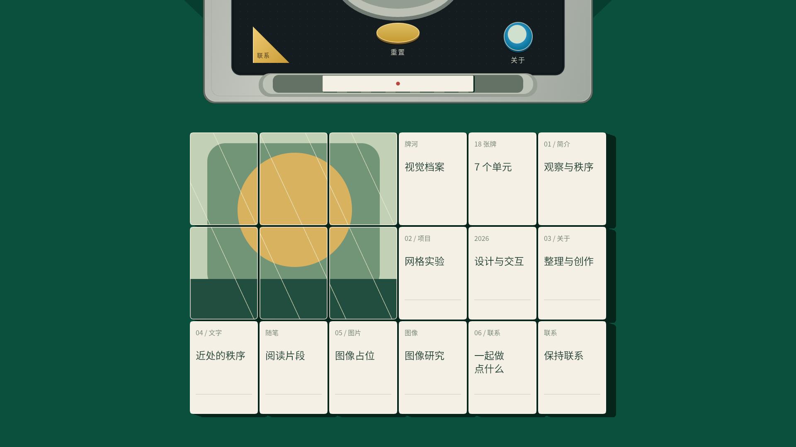

# ShinRyu · 牌河视觉档案 v2

`v2` 从 `main` 创建，保留现有交互，将麻将改为 **Three.js 三维实体 + 三渲二材质 + 真实光源阴影**。上方控制盒仍由二维 Canvas 与 HTML 按钮绘制。

槽内点棒也已改为三维实体：无文字的传统白色千点棒，中央一枚红点。点击、Enter / 空格或触屏轻点，会拿起、略微倾斜，然后松手掉落，产生端部碰撞、弹跳和逐渐停止的摇晃。



## 保持的交互

- 初次打开：18 张蓝背进场，1100 ms 后可操作，不自动揭示。
- 点击任意蓝背牌：以该牌为中心波纹翻到正面；单牌 600 ms，全场最多 1200 ms。
- **重置**：正面状态可操作，以左上角为中心波纹翻回蓝背，支持反复展开和重置。
- 单牌悬停：围绕自身中心放大 4%，独立内容同步变化，邻牌不缩放。
- 正面点击不弹窗。关于、联系保留外观，暂未启用。
- 鼠标、键盘 Enter / 空格、方向键及触屏交互保持不变。
- 无论系统“减少动态效果”设置如何，都执行上述默认动画。

## 白色点棒与掉落

- **实物参考**：[日本麻雀用具专门店的白色千点棒](https://item.rakuten.co.jp/auc-e-mahjong/siro-tenbo1000/)，商品尺寸约 65 × 7 × 3 mm。按相同比例放大为 364 × 39.2 × 16.8 的圆角实体；中央红点嵌入两侧宽面，棒体不显示标题或点数文字。[近代麻雀的点棒说明](https://kinmaweb.jp/mahjong-rule/tenbou)确认传统点棒依靠点纹区分点数。
- **拿起与松手**：360 ms 抬起，每次改变长轴、短轴方向的倾角；随后在重力作用下掉落。拿起下一次时，从上一次落定的实际位置和方向连续开始。
- **碰撞与弹跳**：使用 240 Hz 固定步长计算刚体角动量、惯性、角点接触冲量、恢复系数和摩擦。一端先着地会带动棒体旋转，再发生另一端碰撞和回弹，约 1.2–1.4 秒后落定；没有预设的上下往返弹跳曲线。
- **同一三维场景**：与麻将共用正上方正交相机、卡通材质和唯一方向光，阴影随真实高度和姿态变化。槽位、控制盒和导航按钮仍为二维。
- **独立交互**：点棒掉落期间忽略重复点击，可以同时翻牌或重置；落定后可再次拿起。没有新增弹窗，也不根据系统动画偏好跳过动画。


## 三维与二维的组合

- **正上方正交相机**：采用无近大远小的平行投影，保持原有正俯视构图。画布仍为 1920 × 1080，6 × 3 牌阵、164 × 224 牌面、4 px 间距；窗口缩放只等比缩放，不改变相机方向。
- **真实实体**：每张牌使用圆角挤出几何体，具有 132 的厚度，蓝背 / 牌芯 / 正面分层为 32 / 92 / 8。翻转是绕长轴的真实三维旋转，抬起使用真实高度；最低点始终位于桌面之上。
- **独立贴图**：仍在加载后切分跨牌图像，每牌持有自己的正面片段。正面 UV 预先校正，翻转完成后文字正向且不镜像。
- **三渲二材质**：使用单一白色梯度的 `MeshToonMaterial`，保持既有纹理和分层配色。牌面不附加明暗渐变、自阴影、高光或反射。
- **真实光源**：只使用一个方向光和深度阴影贴图，桌面接收模型投射的真实硬边阴影。阴影随实体轮廓、旋转和抬起高度变化，已删除固定右影矩形、牌缝色块和拼接阴影的模拟代码。
- **没有新增光影效果**：没有环境光、环境贴图、AO、辉光、景深、软阴影或镜面反射。控制盒不参与三维光照。
- **保留运动模糊**：牌体与贴图采用 7 个短时间样本的 GPU 线性 RGBA 合成，阴影仅取当前帧，不参与采样。停止时牌面清晰，阴影始终硬边。
- **优化渲染区域**：三维画布覆盖点棒、牌阵和活动轮廓区域；抗锯齿采样与阴影分辨率随显示尺寸分配，保持手机和 4K 等比构图。

## 本地预览

```sh
python3 -m http.server 8080
# 浏览器打开 http://localhost:8080
```

无需 `npm install` 或构建。使用支持 **WebGL 2** 的现代浏览器，通过 HTTP 预览，避免 `file://` 的模块加载限制。

## GitHub Pages

本分支仍为纯静态文件，支持 GitHub Pages 的 `/ShinRyu/` 项目路径。Three.js 固定为 **0.180.0**，随仓库本地分发，不依赖外部 CDN。

如需部署 v2，在 **Settings → Pages → Deploy from a branch** 中选择 **v2 → / (root)**。这会将现有 Pages 站点切换为 v2；创建本分支本身不会修改 main 或现有 Pages 发布来源。

部署完成后访问 **https://5h1nryu.github.io/ShinRyu/**。

## 检查与文件

可选检查需要 Node.js 22 或更高版本，无需安装依赖：

```sh
npm run check
npm test
```

测试覆盖尺寸、双向波纹、模型厚度、真实旋转关键帧、桌面穿透、正面 UV 方向、正交相机、抬起高度连续性，以及点棒的实物比例、端部碰撞、回弹、落定和重复拿起。检查工作流同时覆盖 main 与 v2 的推送。

| 文件 | 用途 |
| --- | --- |
| `index.html` / `styles.css` | 二维控制盒、三维画布和可访问按钮 |
| `app.js` | 原有状态机、交互、逐牌纹理和二维控制盒 |
| `mahjong-3d.js` | 三维模型、卡通材质、单光源真实阴影和 GPU 采样 |
| `geometry.js` | 布局、双向时序和投影速度计算 |
| `score-stick.js` | 白色点棒尺寸、重力、刚体接触与轨迹采样 |
| `assets/` | 原创 SVG 与站点图标 |
| `vendor/` | 本地固定版本 Three.js 与 MIT 许可证 |
| `tests/` | 交互几何与三维模型验收 |

替换 `assets/artwork.svg` 和 `app.js` 中 `buildTextures()` 的文字即可更新内容。模型和交互无需修改。
