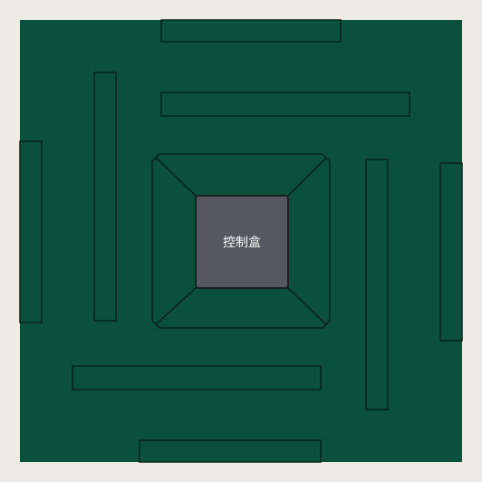

# 接缝参考图标定

以本轮用户提供的 **730 × 486** 俯视图为准，使用左侧白色桌的像素坐标。
控制盒范围取 `x=158..209, y=211..262`，边长为 **51 个参考像素**。
网页中已有控制盒边长为 910 个设计像素，故全部接缝采用同一个比例
`910 / 51`；将参考控制盒左下角 `(158,262)` 对齐网页外壳左下角。
保留参考图可见的取整差异，不强制四条槽完全对称，也不为了让槽口露出而移动它们。

| 接缝 | 参考图左上角 (x,y) | 参考图宽×高 | 长边 / 控制盒边长 |
| --- | --- | --- | --- |
| 上侧升牌口 | (139,154) | 137×13 | 2.686 |
| 右侧升牌口 | (252,191) | 12×138 | 2.706 |
| 下侧升牌口 | (90,305) | 137×13 | 2.686 |
| 左侧升牌口 | (102,143) | 12×137 | 2.686 |
| 上侧出牌口 | (139,114) | 99×12 | 1.941 |
| 右侧出牌口 | (293,193) | 12×98 | 1.922 |
| 下侧出牌口 | (127,346) | 100×12 | 1.961 |
| 左侧出牌口 | (61,181) | 12×100 | 1.961 |

中央盖板范围为 `x=134..232, y=188..284`，宽、高分别为控制盒边长的
`98/51 = 1.922`、`96/51 = 1.882` 倍。轮廓的四个角采用参考图的切角，
四条斜向分隔缝连接到控制盒相应角点。

全部原始坐标与换算保存在 [`table-surface.js`](../table-surface.js) 中。
这些数字描述该参考图中的比例，不是厂家公布的实物尺寸；精度受参考图像素影响。
参考图不随站点分发。

固定相机、原有 1920×1080 物件构图与控制盒裁切保持不变。桌面背景画布覆盖
全部位于当前裁切下方的接缝；宽屏或竖屏按视口自然显示对应部分，页面不允许滚动。
接缝仍为 3 个设计像素宽，麻将、点棒、牌面与重置动画保持现有行为。
